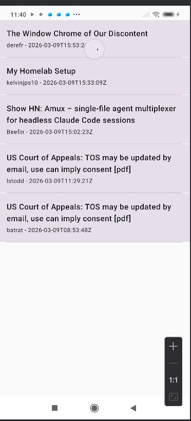
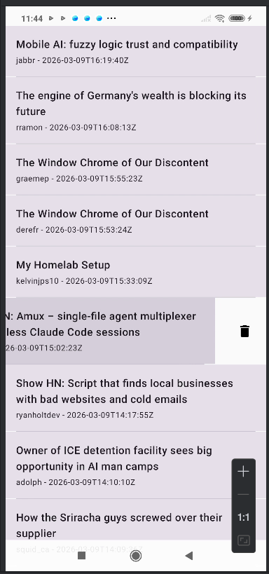

# HackerNews Mobile Reader

Android application built as part of a Mobile Developer technical test.

The app displays recent mobile-related posts from Hacker News using the Algolia API.

Users can browse posts, refresh the list, delete posts, and open articles inside the app.

---

## Features

- Fetch latest posts related to **mobile development**
- Pull to refresh posts
- Swipe to delete posts
- Deleted posts do **not reappear after refresh**
- Offline support using **Room database**
- Open article **inside the app** using WebView
- Loading state
- Error state
- Empty state
- Unit tests included

---

## API

The application consumes the following endpoint:

https://hn.algolia.com/api/v1/search_by_date?query=mobile

---

## Screenshots

### Posts List

### Swipe to Delete

### Article WebView

---

## Tech Stack

### Language
Kotlin

### Architecture
Clean Architecture + MVVM

### Libraries

- Jetpack Compose
- Hilt (Dependency Injection)
- Retrofit
- Moshi
- Room
- Coroutines
- Flow
- Navigation Compose

### Testing

- JUnit
- Coroutine testing

---

## Architecture

The project follows **Clean Architecture** with three main layers.

### Presentation Layer
Handles UI and user interaction.

Components:
- Compose Screens
- ViewModels
- UI State

### Domain Layer
Contains business logic.

Components:
- UseCases
- Domain Models
- Repository interfaces

### Data Layer
Handles data sources.

Components:
- Retrofit API
- DTO models
- Room database
- Repository implementation
- Data mappers

---

## Architecture Diagram
        UI Layer (Compose)
                 │
                 ▼
            ViewModel
                 │
                 ▼
              UseCase
                 │
                 ▼
        Repository Interface
                 │
        ┌────────┴────────┐
        ▼                 ▼
   Remote API        Local Database
   (Retrofit)           (Room)

---

## Data Flow

API → DTO → Mapper → Entity → Database → Flow → ViewModel → UI

When refreshing:

API  
↓  
DTO  
↓  
Mapper  
↓  
Room Database  
↓  
Flow  
↓  
UI updates automatically

---

## Offline Support

Posts are cached locally using **Room**.

If the device is offline, the application displays the **last downloaded posts**.

---

## Delete Behavior

Posts can be removed using swipe gesture.

Deleted posts are persisted locally and **will not reappear after refresh**.

---

## Running the Project

### Requirements

- Android Studio Hedgehog or newer
- JDK 17
- Android SDK 24+

### Steps

1. Clone the repository

git clone https://github.com/dominikyeyo/hackernews-android-compose.git

2. Open the project in Android Studio

3. Sync Gradle

4. Run the application

No API keys or additional configuration are required.

---

## Running Tests

Unit tests are included for:

- `PostsViewModel`
- `PostRepositoryImpl`

Run tests with:

./gradlew test

or directly from Android Studio.

---

## Project Structure

core
├── database
├── di
└── network

data
├── local
├── remote
├── mapper
└── repository

domain
├── model
├── repository
└── usecase

presentation
├── post
├── webview
├── navigation
└── common

---

## Author

Diego Nuñez  
Android Developer
